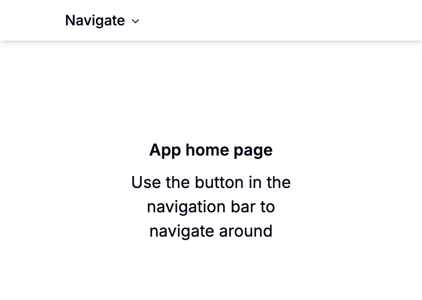

This is a minimalist Next.js project showcasing how to:
- Render custom error pages when SSR failed.
- Render custom 404 pages when the resource you're looking for cannot be found.

## Example pages
You can use the navigate button on the top to view all available examples.

